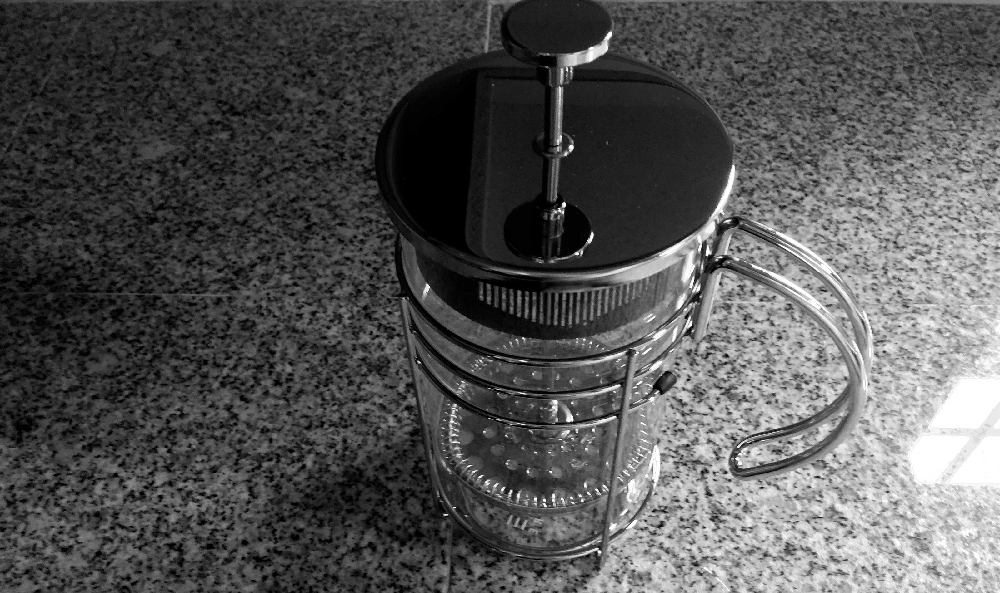
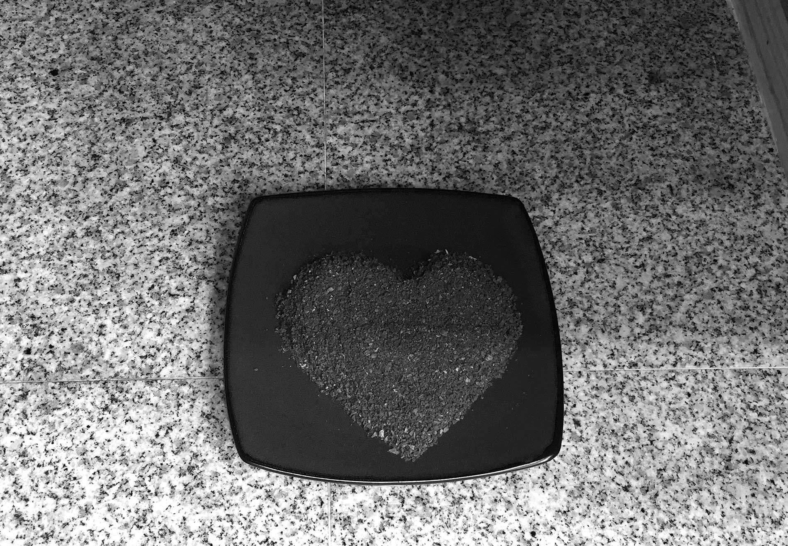
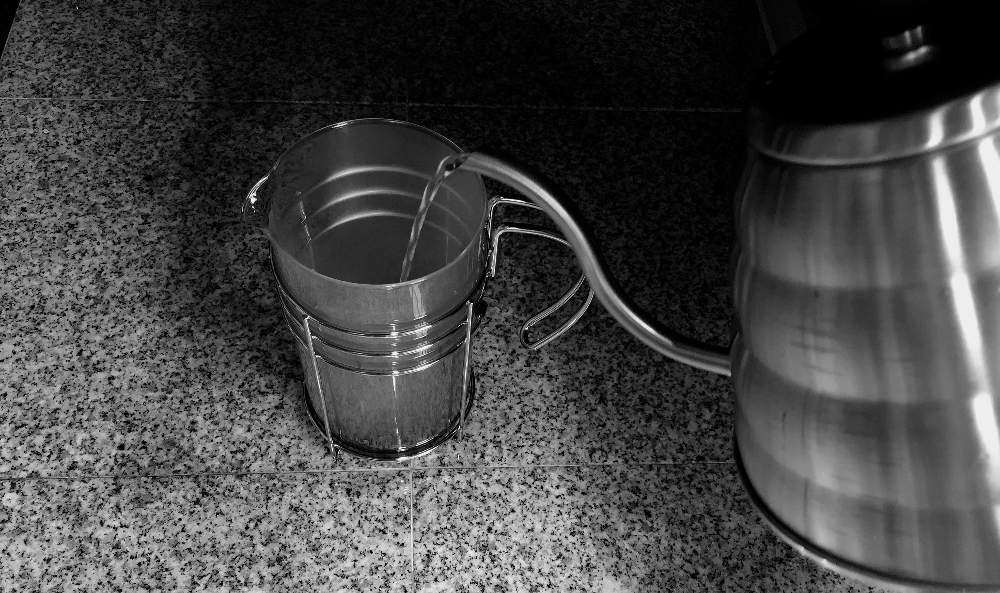
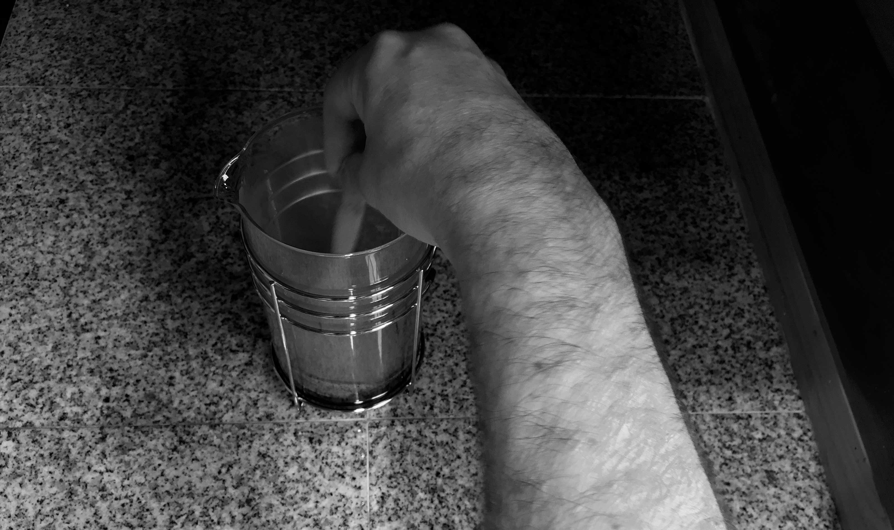
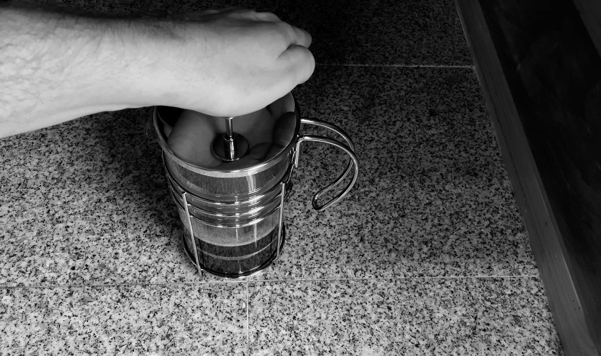
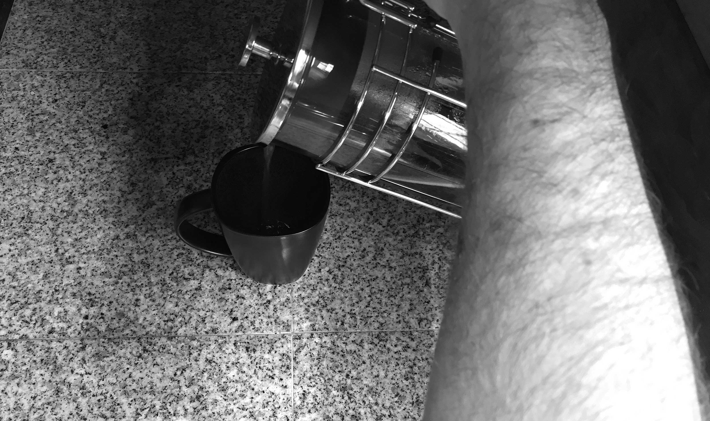

# French Press

<small>
  The venerable French press in all its shiny glory
</small>

The process for brewing coffee with a French Press is fairly simple, and is
usually described in the instructions accompanying the press.

That said, you should be mindful of the coffee continuing to brew if you
press it and then leave it in the press for extended periods of time; this
will cause over extraction and impart a bad taste in the remainder of the
coffee.

Follow these steps to brew nice coffee with your French Press.

Ensure that all components of your French press are as clean as possible and
boil enough water to provide a one-to-ten ratio of ground coffee beans to
water.

For the example in this guidebook, a 34 ounce press is used which would call
for approximately 80 grams of coffee beans and 800 milliliters of water.

<small>
  The lovely smell of freshly ground coffee beans
</small>

While your water boils, grind the required amount of coffee beans to the
consistency of rough sea salt. Remove the top/plunger of your press and
pour in the ground coffee beans.

<small>
  Pour water to cover the ground coffee
</small>

Once the water has reached a boiling temperature (or your preferred
temperature), pour in enough water to cover the ground coffee.

<small>
  Stirring, stirring — ever so gently
</small>

Use a wooden spoon or paddle to gently stir the coffee mixture. Gently.
Do not use anything metal to stir as it could easily crack the glass of your
press in the process. Allow the coffee mixture to bloom and release excess
carbon dioxide for about 30 seconds.

After blooming has occurred, go ahead and pour in your remaining water in
slow counter-clockwise circles. Ensure that at least an inch of free space
between the water level and the top of your press glass exists.

<small>
  Slow and steady pressing
</small>

Now comes the fun part; press the plunger top slowly and steadily. When doing
so, take note of the amount of resistance encountered. If the press plunger
drops very quickly with minimal resistance, then your coffee grind is too
coarse. If the press plunger is hard to push down, then your beans were
likely too finely ground.

What ever you do, **do not press too firmly or quickly** as the hot mixture
could be forced out in the process.

<small>
  Coffee time!
</small>

Once you've pressed the plunger all the way down, you're now ready to
pour. Most presses have an additional filtering area in the lid, so you should
examine yours to make sure that you have rotated the lid so that your
coffee will actually pour out.

Remember that the coffee should not be left in the press or it will continue
to brew, so pour any excess coffee into a carafe for later enjoyment.

Pour a cup and enjoy your French pressed coffee!
