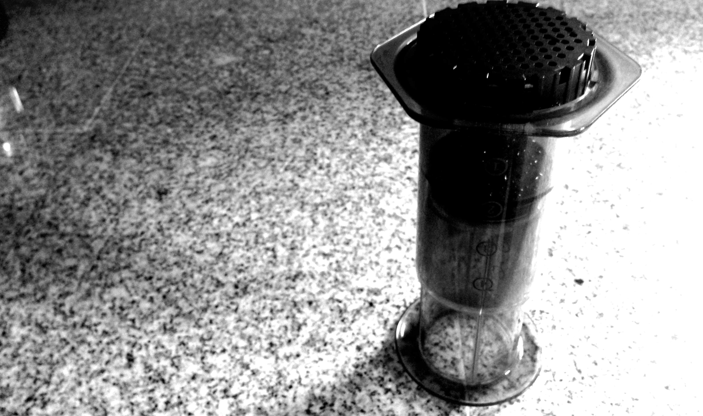
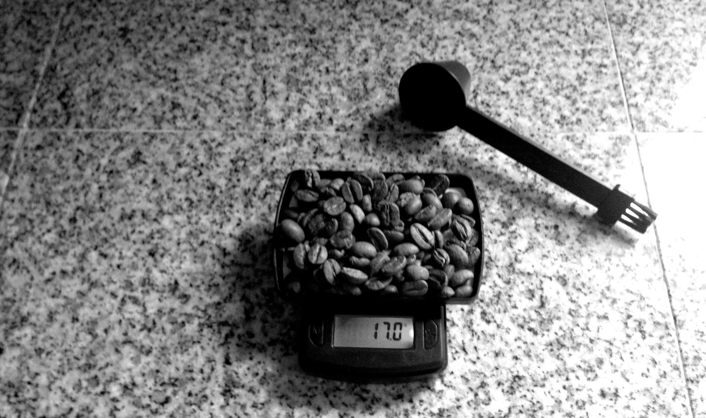
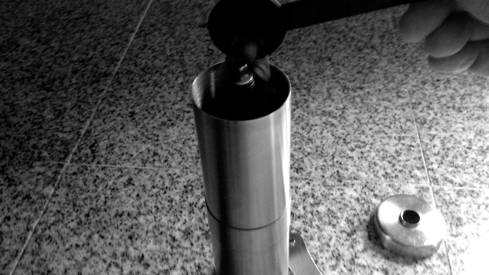
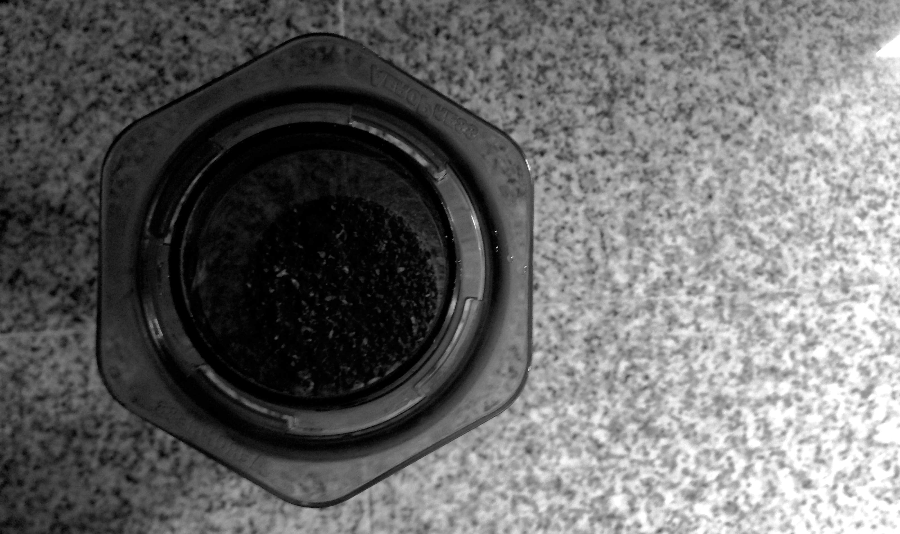
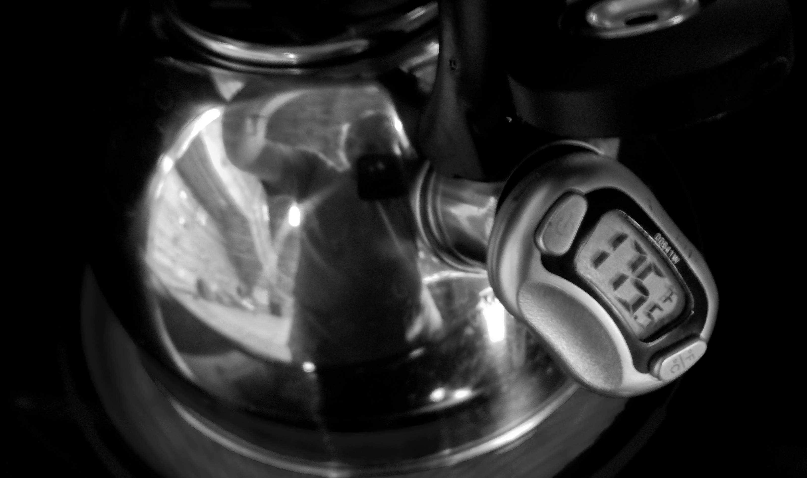
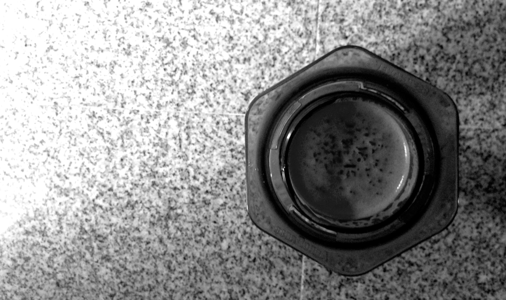
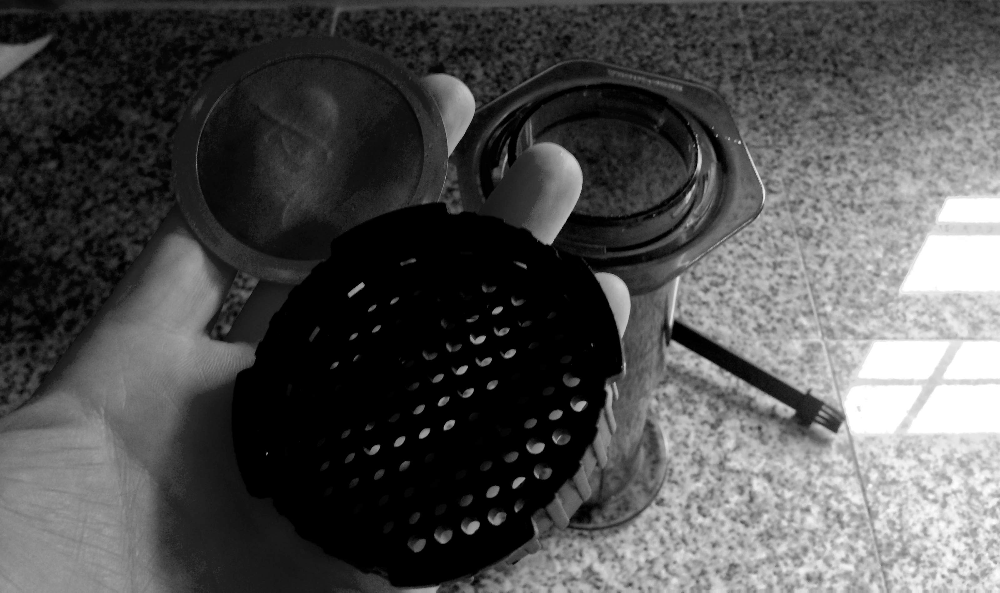
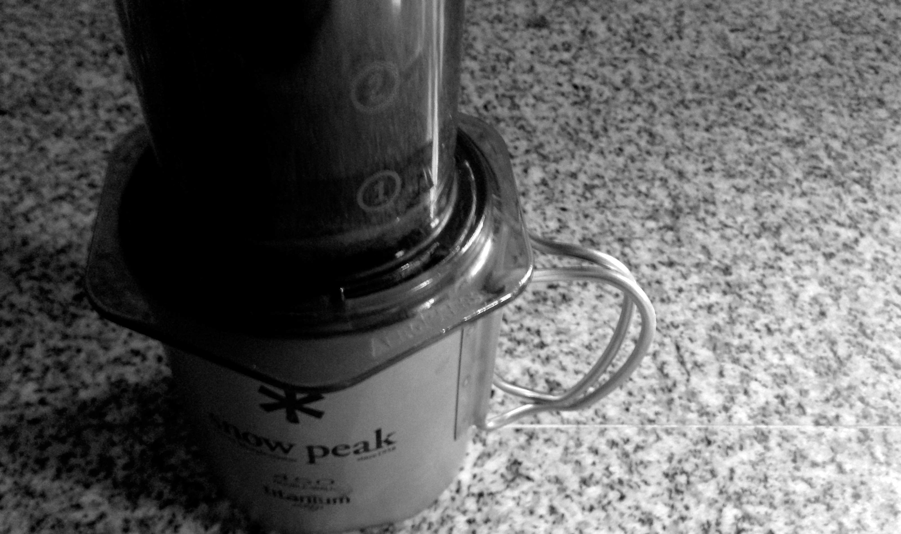
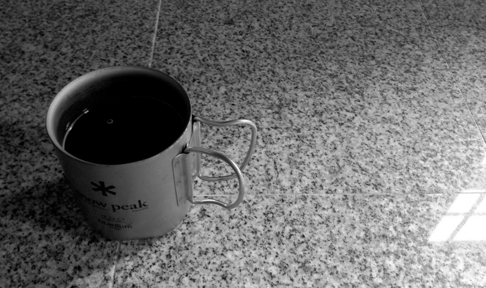

# Aeropress

The [Areopress](https://en.wikipedia.org/wiki/AeroPress) is a like a giant caffeine syringe for brewing a
surprisingly good cup of coffee. It was invented by Alan Adler who also
invented the Aerobie flying disc.

You can think of the Aeropress as a contemporary French Press that employs
a slightly different technique and uses a bit more suction in the pressing
operation thanks to a tight rubber plunger seal.

There are two main methods to brewing coffee with the Aeropress, the
traditional method as recommended by the instructions that accompany the
device, or the *inverted method* which many prefer because it allows the
coffee mixture to steep more effectively.

While the directions that are packaged with the Aeropress describe how to
brew with the device, I'm going to cover the steps I use for the inverted
method here in seventeen easy but tedious steps.

<small>
An inverted Aeropress
</small>

Ensure that all components of the press are as clean as possible. Assemble the Aeropress body and plunger; for one cup of coffee, a good stop for the plunger is at the line marked **3**.

<small>
17 grams of beans ready to grind
</small>

Grind approximately 15-17 grams of beans; use a fine to medium grind that is not quite coarse as you'd expect for a drip coffee grind.

<small>
Feeding beans into a Porlex JP-30 manual burr grinder
</small>

I like to use a nice manual burr based grinder with ceramic burrs. Really nice electric ones are available, but also quite expensive.

The small, hand operated grinders are portable and good for the great outdoors, too.

<small>
Beans ground and ready for a nice soak in hot water
</small>

Invert the Aeropress so that it rests on the top of the plunger with the open
body exposed and carefully add the coffee grounds to the the inverted
Aeropress. Do not allow ground coffee to settle into the locking groove of
the top.

<small>
Water being heated to 175°F in a kettle
</small>

Prepare roughly 200 grams of water using tips from the **Water Temperature**
section to your preferred temperature, and then pour about 30 grams into the
press initially to soak the grounds so that the coffee can bloom, expand, and
release some carbon dioxide.

<small>
Blooming then steeping is the fun part filled with anticipation
</small>

After about 30 seconds of bloom, add the remainder of water until the press
is almost full, leaving approximately 1/4 inch of space at the top of
the press.

Stir the coffee mixture thoroughly using the Aeropress paddle or a bamboo
paddle if preferred for at least 10 seconds.

Allow the coffee mixture to steep for approximately 1 minute.

<small>
Aeropress with cap and stainless steel mesh filter
</small>

Add a filter (either paper or stainless steel) to the Aeropress lid. Then,
**carefully** attach and turn the lid onto the inverted press, ensuring that
it is locked into place.

**Cautiously** and deftly invert the press so that it is right-side-up over
the vessel you intend to press the coffee into (I use my coffee cup).

<small>
Pressing the coffee
</small>

Over the course of approximately 20 seconds, slowly and gently press the
plunger down on the Aeropress until you're squeezing against the coffee
grounds.

Top off the cup with remaining hot water, stir the coffee, and introduce your additives (if that's your thing).

<small>
A fresh and delicious cup of coffee
</small>

Finally, enjoy your coffee.
