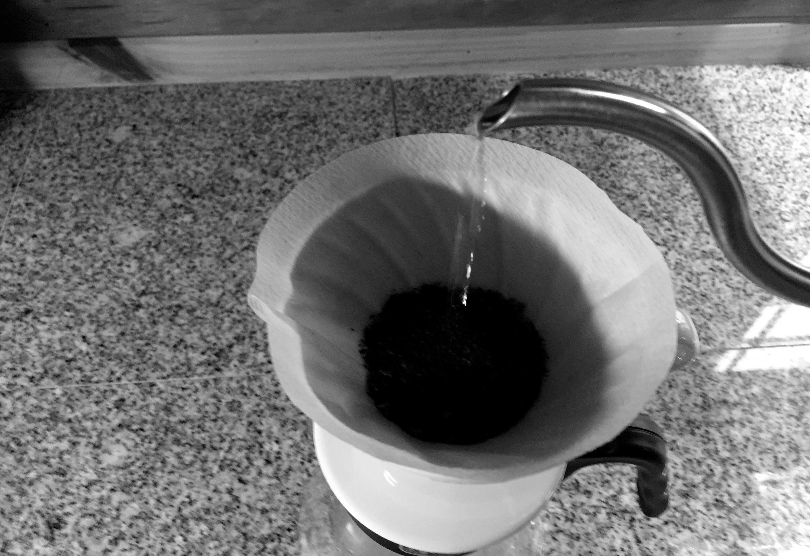

# Pour Over

<small>
  A stainless steel Hario kettle is popular for the pour over technique.
</small>

The pour over drip method is a great way to brew a delicious cup of coffee.
It is my personal favorite, and what I consider the best way to make non
espresso drip coffee.

It takes about 5 minutes to brew coffee with the pour over method; follow
these steps to enjoy a great cup:

Heat about 600 to 700 milliliters of water to a boiling temperature; half will
be used to warm the dripper and carafe and half will be used later after it
has cooled a bit.

<small>
  Thoroughly wet the entire filter.
</small>

Add a filter (or 2 if that's your preference) to the dripper you will use,
and then warm it with the hot water by thoroughly soaking the filter,
which also helps to remove any paper/fibre taste.

Allow the dripper and carafe to warm for about one minute, and while doing
so grind 25 to 30 grams of coffee beans to a coarse grind

<small>
  Grind your coffee beans to the consistency of rough sea salt.
</small>

Once you've ground your beans, remove the dripper and pour water from the
carafe out.

Replace the dripper and add your coffee to the filter.

To ensure your coffee to water ratio is correct, you can also place the
carafe and dripper on a scale, zero its tare setting, observe the water
weight and carefully watch time as you pour during the final brew.

<small>
  Wet your ground coffee so that it can bloom.
</small>

Start with a pre-pour that will allow the coffee to bloom and release
carbon dioxide; pour approximately 20 milliliters of water or just enough to
wet the grounds, and allow 30 seconds or so for the initial bloom.

<small>
  The coffee has bloomed and is now ready for brewing.
</small>

After 30 seconds or so you are ready to begin pouring for the actual brewing
of the coffee.

At this point you can introduce some precision to the brew by setting
a timer for approximately 2.5 to 3 minutes which is the duration you should
aim for when brewing your coffee.

<small>
  Use a steady hand and slow pace to brew and avoid contacting the dripper edges.
</small>

Start the timer and begin slowly pouring the remaining water in the center
of the grounds in concentric circles. Avoid the edges of the grounds and
watch your scale or the measurements of your carafe to ensure that you arrive
at the correct amount of poured water.

<small>
  Brew until the desired water level is reached.
</small>

Once you've poured the correct water amount over the timed range, you're ready
to remove the dripper and begin enjoying your coffee.

<small>
  A pour over can be the tastiest and most invigorating coffee you will ever have.
</small>

Enjoy your delicious coffee!
