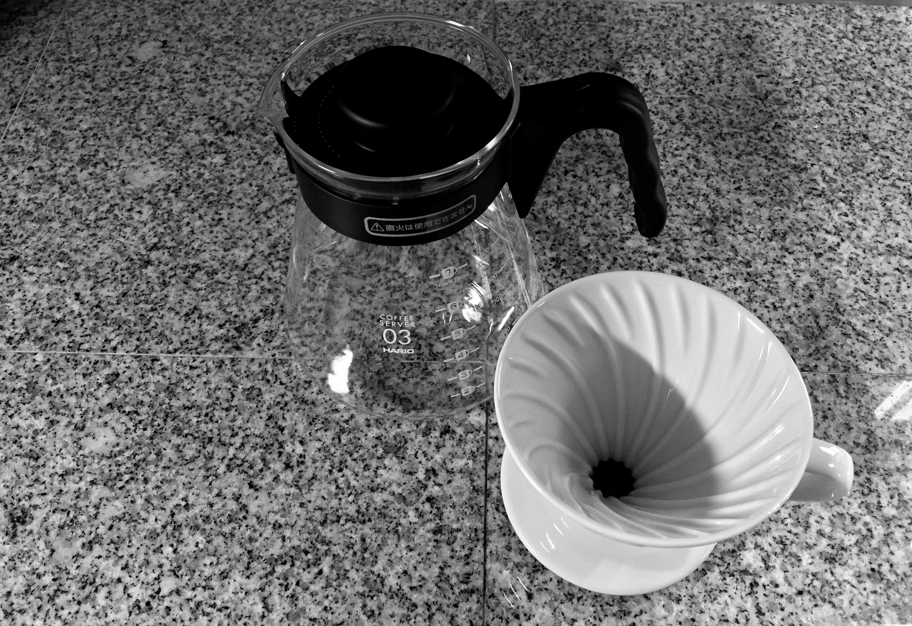
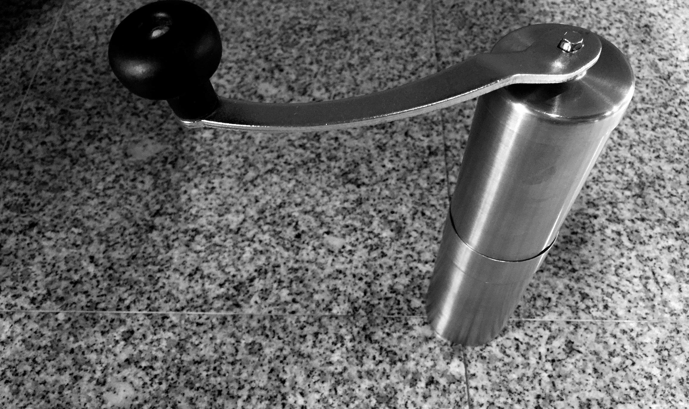
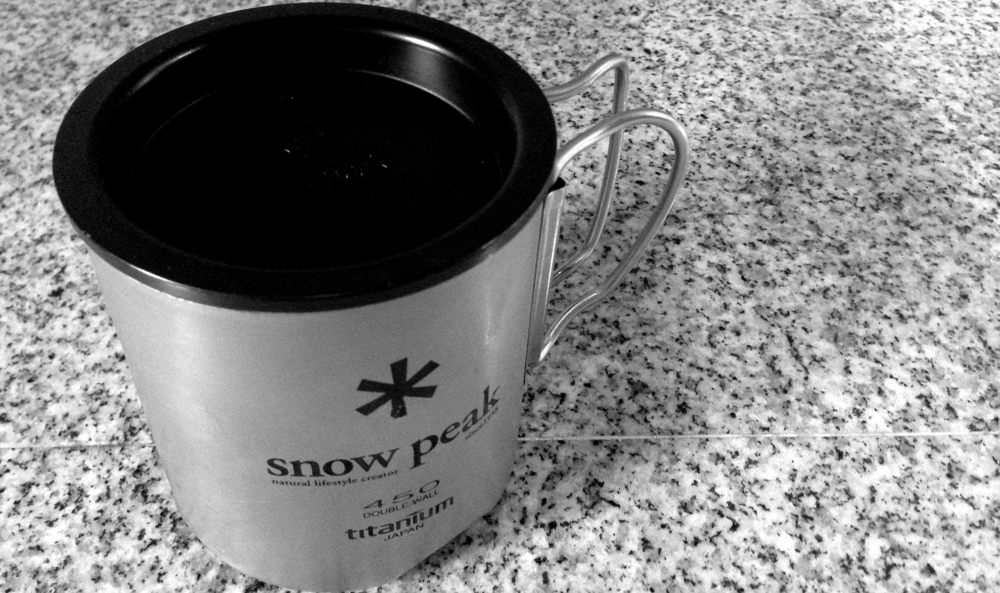

# Equipped for Enjoyment

Selecting quality tools for coffee preparation goes a long way
towards satisfaction in brewing and the end result. I recommend buying the
best equipment you can afford. Keep in mind that quality gear is more
enjoyable to use, and often lasts longer as well.

I have used everything covered in this section, and recommend any of the
items detailed here. However, I do not endorse or represent any of the
vendors listed in this guide.

Some of the equipment here is expensive, but it is all top quality, and you
are investing in tools that you might use multiple times a day. In the end it
will be worth it to get the best gear you can afford.

## Roasting Equipment

I have not moved up to the exciting world of roasting my own coffee beans, so
I don't have any tips for such equipment right now, but stay tuned. I am
definitely planning to do so and will add information about my experiences
to this section.

## Brewing Equipment

<small>
  A Hario dripper and carafe for making pour over coffee
</small>

> "World barista champions use the AeroPress to make coffee on the folding
> tray tables of airplanes."  
>  
> — Timothy Ferriss

From the modest little hotel room plastic drip coffee maker, to elaborate
espresso machines costing well north of ten-thousand dollars, the equipment
for brewing coffee is important.

In fact, I consider the following trinity to be the critical considerations
for excellent coffee:

* Raw materials: Coffee beans and water
* **Brewing Equipment**: Grinders, filters, devices (you are here)
* Process: Use as much science in your process as you can

This section focuses on battle-hardened and time tested gadgetry for
perfecting your brew.

### Grinders

<small>
  The Porlex JP-30 is compact, efficient, and uses no electricity
</small>

Grinding coffee beans seems a simple enough concept, but you should be aware
that it is best to use a particular type of grinder. There are a couple popular
styles of grinder for coffee beans, *blade based* and *burr based* grinders.

While blade based grinders are generally less expensive, they produce an
uneven grind that is incompatible with preferred brewing methods and the spinning blade friction can actually heat the beans enough to add negative flavor effects while grinding.

A burr based grinder produces a nice even grind, and is the preferred type of
grinder to use for the most delicious coffee flavor. Not to mention, when you
need to dial in the grind size for various methods, a burr grinder allows for
this while a blade grinder does not.

The electric models are fancy and can be expensive, while manual models are
far less expensive, more compact, and useful anywhere even without access
to electricity (great for camping!).

Here are some models to consider:

1. [Porlex JP-30](http://www.porlex.co.jp/lineup/coffee.html) is a brilliant
   little stainless steel and ceramic manual burr grinder from Japan. You can
   get them from numerous online retailers for approximately $50. There is
	 also a mini version that is even more compact.
2. [Hario MSCS-2TB](https://www.hario.jp/seihin/productgroup.php?group=MSCS-2TB) another wonderful ceramic manual grinder featuring a glass vessel instead of stainless steel
   as found in the JP-30
3. [Baratza Preciso Coffee Grinder 685](https://www.baratza.com/conical-burr-grinders/preciso-grinder/) expensive, but professional and well built electric powered burr grinder.
   Can be had for about $300 — perhaps the only electric grinder you'll ever
   need
4. [Baratza Encore Coffee Grinder](https://www.baratza.com/grinder/encore/) is an entry level with the same great Baratza quality for under $150.
5. [Baratza Sette 270](https://www.baratza.com/grinder/sette-270/) is a professional strength, quiet, and fast grinder.
6. [Capresso Infinity Conical Burr](http://www.capresso.com/coffee-grinders/conical-burr/infinity-conical-burr-grinder-stainless-steel-1.html) a quality electric conical burr grinder for under $100.

  Note that burr based grinders need frequent cleaning to operate at their
  full potential. You should consult the grinder's user manual for a
  recommended cleaning cycle. Typically, you'll want to thoroughly clean
  your grinder about once a week.

**What do you do?**

I use the Porlex JP-30; I prefer the manual action for many reasons, such
as using less electricity and doing things the old fashioned way. Getting
used to grinding beans this way also means that I can use the same grinder
in my kitchen and in a tent on a mountainside. Due to its all metal
construction, it's more rugged than other similar grinders too.

A couple negative things I can report about the JP-30 is that the detachable
handle appears made of a soft steel alloy, and the hexagonal hole that
mates with the grinding action can become worn and loose, which causes the
handle to climb, and eventually pop off during grinding.

Perhaps making the handle out of a more robust steel or even a titanium alloy
or using a Torx type pattern could address the rounding out of the
hexagonal hole.

Also, after time, the grinds container section becomes looser fitting, and
if you're not carefully holding it, that section can slip off while grinding
and spill your freshly ground beans. :(

  Protip: It's worth noting that the Porlex JP-30 or Porlex Mini will fit inside the plunger part of an AeroPress, making for a compact and neat travel setup.

I am going to try using the Hario MSCS-2TB as my daily home grinder, and
stick to using the Porlex for camping and travel since it is more compact.

### Kettles

Prepare your hot water in some kind of vessel optimized for coffee
preparation. In a pinch, one could use a stainless steel cooking
saucepan to heat water, or a tea kettle. Microwaves are not recommended for
serious coffee water preparation.

Here are some kettles which have proven to be handy for brewing coffee
with presses and the pour over method:

1. [Hario V60 Coffee Drip Kettle "Buono"](http://www.hario.jp/product/list.php?middelclass=3)
2. [Bonavita 1 Liter Stovetop Gooseneck Kettle](http://bonavitaworld.com/products/10l-stovetop-gooseneck-kettle)
3. [Bonavita 1 Liter Digital Variable Temperature Gooseneck Kettle](http://bonavitaworld.com/products/10l-digital-variable-temperature-gooseneck-kettle)

### Presses

1. [Bodum Chambord 8 cup French Press](http://bodum.bodum.com/us/en-us/shop/detail/11053-16/) The classic chrome Bodum is a great
   classic French Press model that brews a fine cup of coffee.
2. [Grosche Madrid 1 Liter French Press](http://www.grosche.ca/product/french-presses/madrid/)
3. [AeroPress](http://aerobie.com/products/aeropress.htm)

### Filters

1. [The Kaffeologie S Filter](http://www.kaffeologie.com/shop/s-filter-for-aeropress-coffee-makers)

### Cups

Needless to say, you should not be drinking fine coffee from a plastic or
polymer cup. Use ceramic, glass, stainless steel, or titanium for cups which
preserve the coffee taste and offer the performance characteristics you
require for daily use.

**What do you do?**

I usually drink my coffee from a [Snow Peak 450](http://www.snowpeak.com/tableware/cups-mugs/titanium-double-450-mug-mg-053.html) double walled titanium mug with matching lid.

It's an expensive imported mug, but well worth it and particularly so for
enjoying coffee in the great outdoors while camping or while out on the water.

I will also sometimes drink from typical stoneware mugs as well.

### Scales and Thermometers

1. [ThermoWorks Thermapen Thermometer](http://www.thermoworks.com/products/thermapen/)
