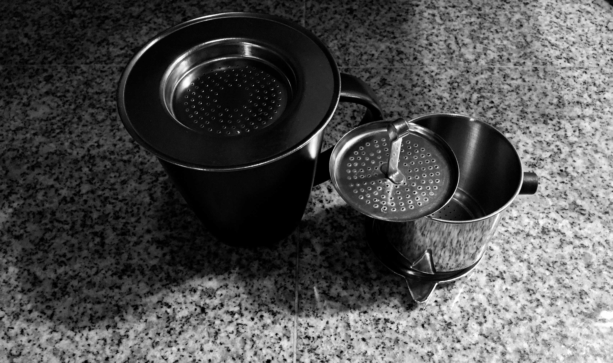
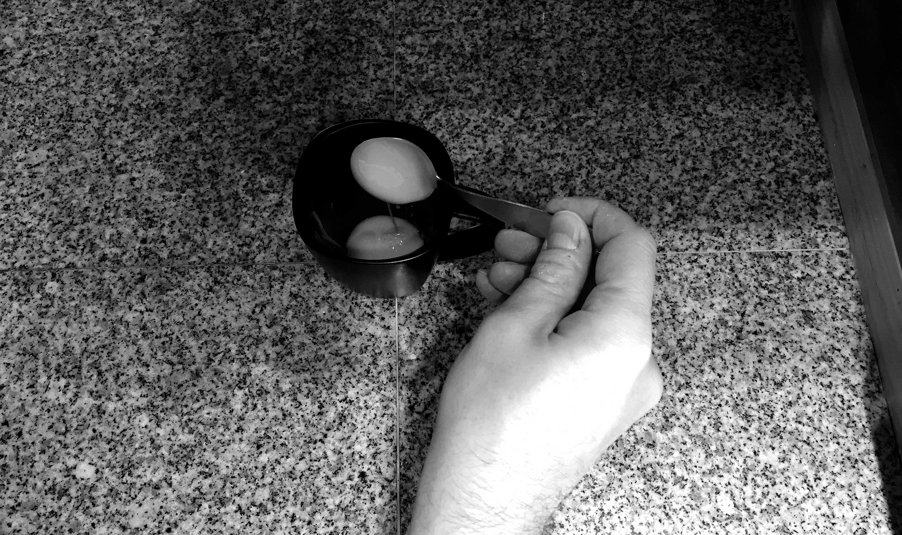
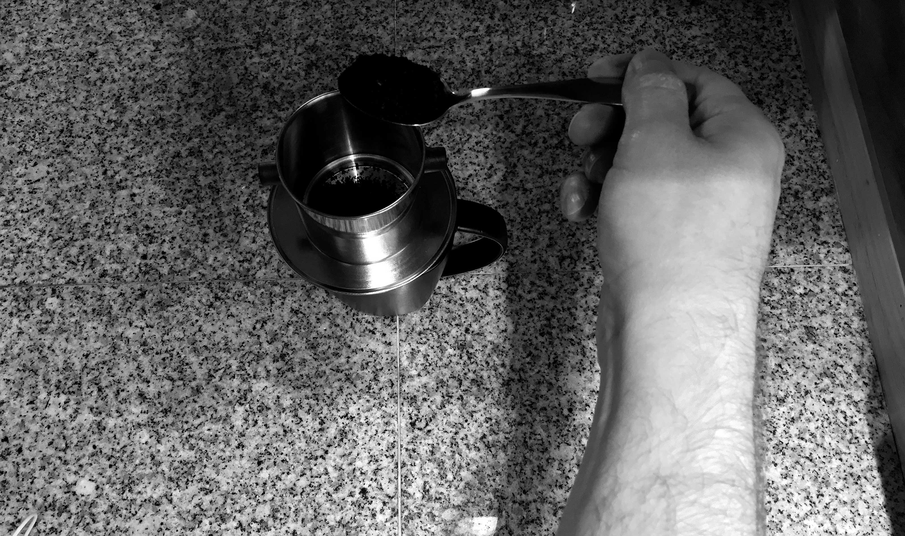
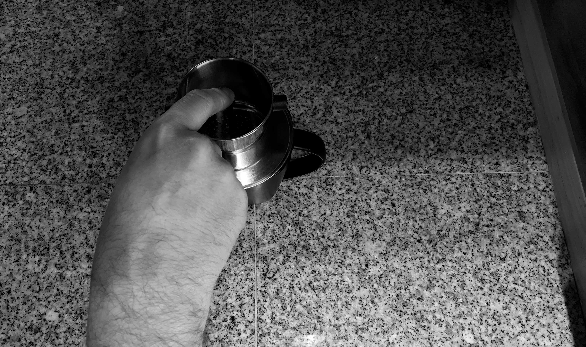
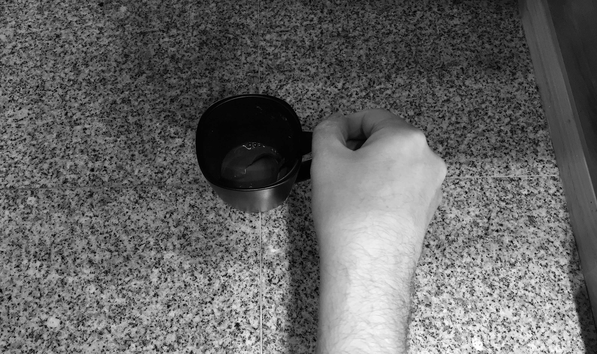

<small>
  A phin is used to brew Vietnamese coffee
</small>

Coffee in the Vietnamese style is extremely rich and flavorful. The
traditional and popular brand of Vietnamese coffee is Trung Nguyên. This
historical and sought after coffee is roasted in "butter oil" and contains
traces of cocoa, making it an exceptionally unique flavor when also brewed on
top of condensed milk as is the usual custom.

The following is my technique for brewing a reasonably strong shot of
Vietnamese style coffee. As with any brewing technique, you should feel free
to explore and experiment while formulating a brew that fits your own taste.

Start by heating water to your preferred temperature; Use approximately 100
milliliters for one reasonably strong shot. If you'd like the shot to be
stronger, you can use as little as 60 milliliters of water; see the
**Water Temperature** section for tips on the ideal coffee brewing temperature
ranges. As with many techniques, you should heat more water than you'll need
so that you can warm the vessel you will brew into with some of the hot water.

<small>
  Adding the condensed milk
</small>

Once your water has reached your desired temperature, use some of it to warm
the cup you intend to brew into. Next, go ahead and add 2 teaspoons of
condensed milk to the cup.

<small>
  Spoon in the coffee
</small>

Now prepare your phin atop the cup; spoon in 3 well rounded teaspoonfuls of
coffee into the phin. Gently shake the phin to evenly distribute coffee
throughout.

<small>
  Gently press the coffee
</small>

Use the tamper portion of the phin to gently press down on the coffee.
Do not press too firmly however, as brewing will be negatively affected by
coffee that is too tightly pressed.

<small>
  Initial water pouring
</small>

Pour in about 20 milliliters of water or just enough to trickle through and
wet the coffee. Place the phin cover on and allow to settle for about 2
minutes.

Remove the lid and carefully pour in the remainder of your desired
amount of water.

<small>
  Allow coffee to brew
</small>

Replace the phin lid and allow the coffee to brew for about 4 more minutes.

<small>
  Stir it up
</small>

Finally, remove the phin from the cup and thoroughly stir the coffee.

Brace yourself for a strong sweet experience and enjoy your cup of
Vietnamese coffee!
